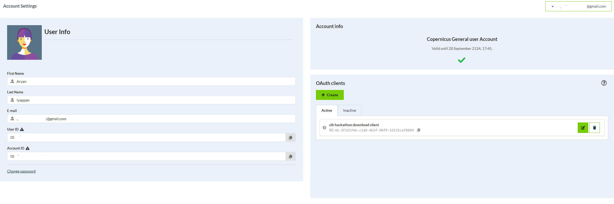

# Sentinel-1 SAR Data Extraction


## Setup Instructions

### 1. Generating Copernicus DataSpace Credentials



1. Create an account on the Copernicus DataSpace Platform
2. Go to [Account settings](https://shapps.dataspace.copernicus.eu/dashboard/#/account/settings)
3. Create an OAuth2 client
4. Copy paste the client ID and client secret into the `.env` file:
```
sentinel_hub_client_id=""
sentinel_hub_client_secret=""
```